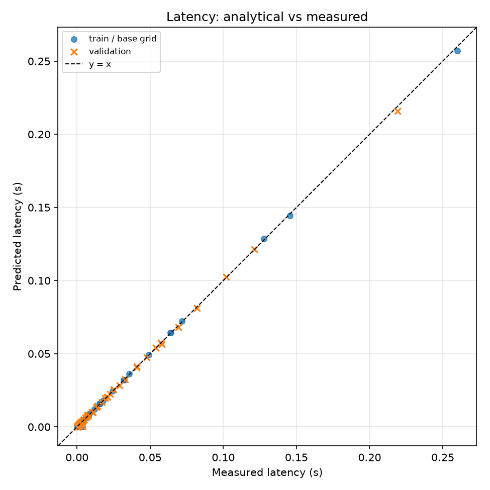
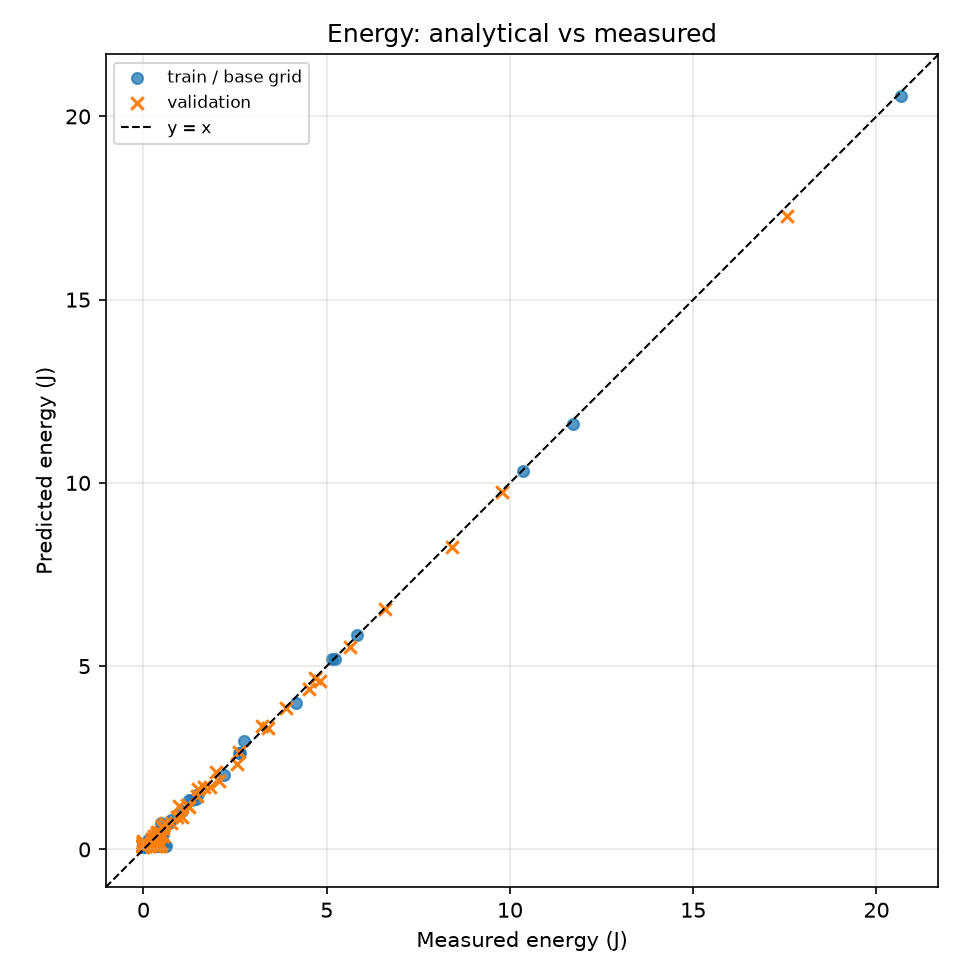
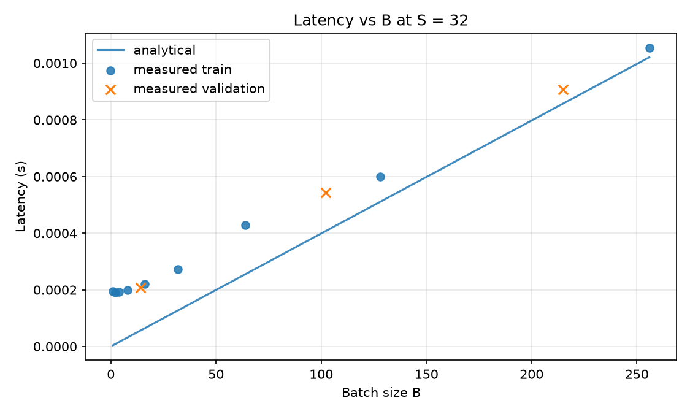
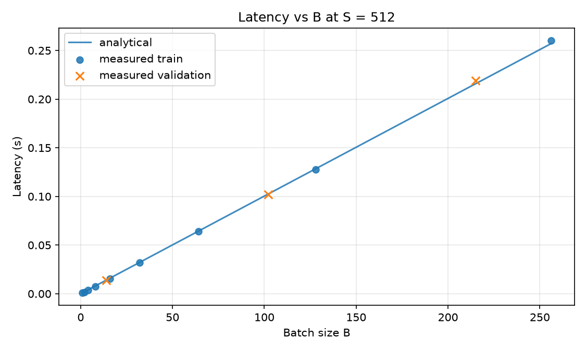
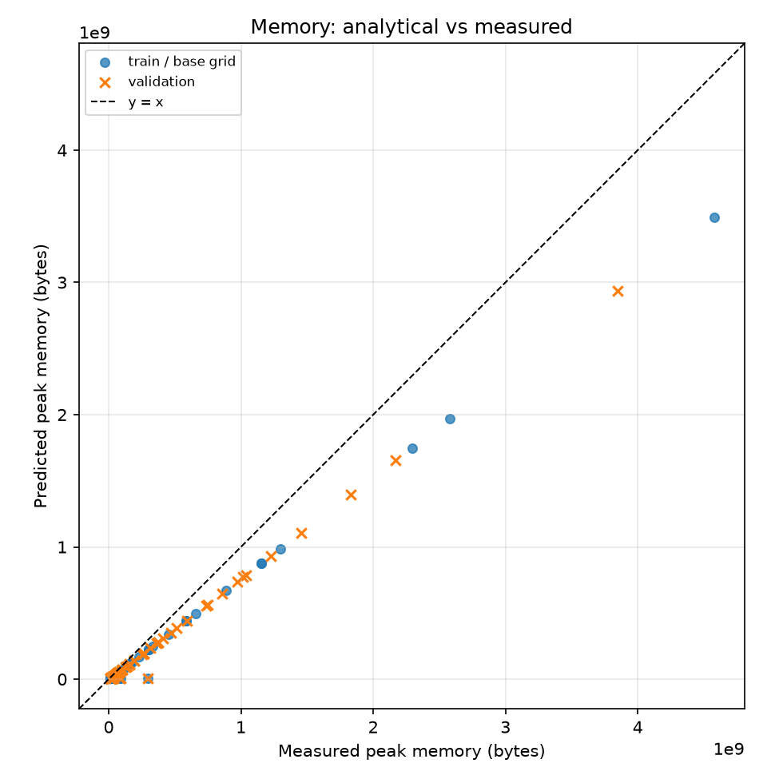
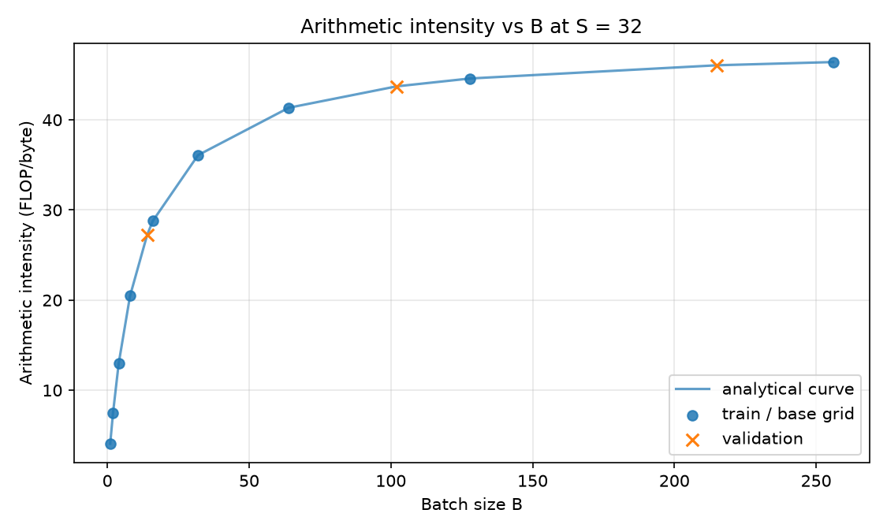
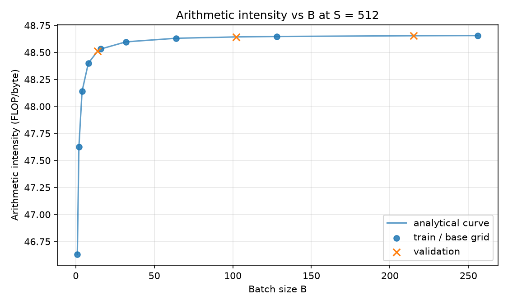
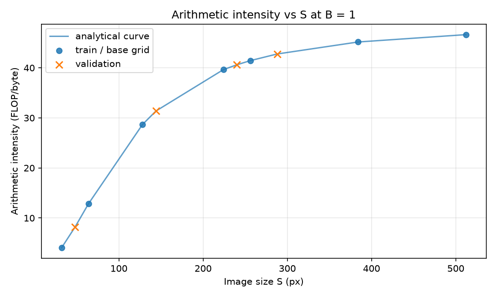
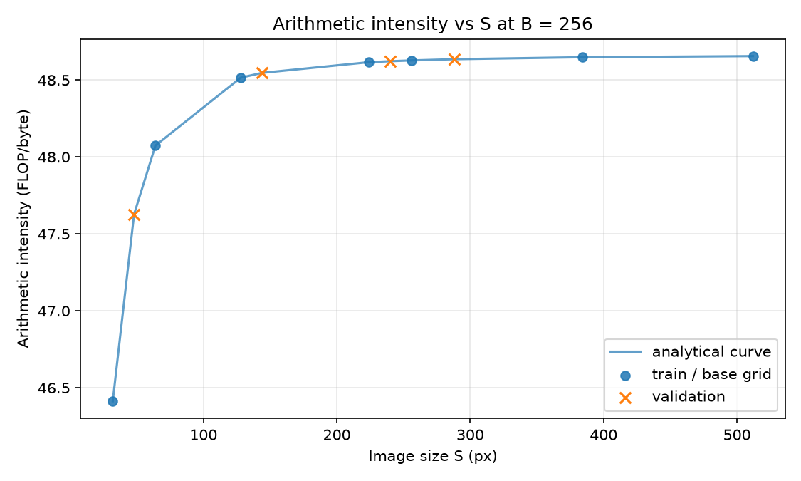

# Домашнее задание 1 — Аналитическая модель производительности небольшой CNN

## GPU и версии ПО

Замеры выполнены на одной **NVIDIA GeForce RTX 4060 Laptop GPU** (≈7.8 ГиБ доступно PyTorch), драйвер **570.211.01**. Стек:

```
Python **3.12.3**, 
PyTorch **2.11.0+cu128** (CUDA **12.8**, cuDNN **9.19.0**)
NumPy 2.5.3
SciPy 1.18.1 
pandas 3.0.6 
Matplotlib 3.11.2 
scikit-learn 1.9.1
nvidia-ml-py 13.610.43 
```

для счётчика энергии NVML. Во всех прогонах `cudnn.benchmark = False`, `cudnn.allow_tf32 = False` и `matmul.allow_tf32 = False`, чтобы FP32 оставался FP32, а cuDNN выбирал kernel по своим эвристикам по умолчанию.

## Как воспроизвести

Из корня репозитория:

```bash
uv sync
uv run python hw1/check_env.py    # проверка GPU / флагов / счётчика энергии
uv run python hw1/calibrate.py    # подгонка θ → hw1/results/theta.json
uv run python hw1/measure.py      # сетка замеров, CSV, графики
```

Точные версии пакетов зафиксированы в `uv.lock` (включая колесо PyTorch `cu128`). Случайные validation-точки `(S, B)` задаются с seed **42**. Результаты пишутся в `hw1/results/` (`theta.json`, `measurements.csv`, `figures/`).

## Результаты

Стоит сразу отметить, что out of memory не было ни при каких комбинациях (B, S).


|                                                                                 |                                                                               |
| ------------------------------------------------------------------------------- | ----------------------------------------------------------------------------- |
|  |  |
| Latency: predicted vs measured                                                  | Energy: predicted vs measured                                                 |


Результаты калибровки формул для Latency и Energy показали себя достаточно устойчивыми на валидационной выборке (оранжевые крестики). Метрика MAPE для Latency и Energy не превосходит 0.22 (в файле results/metrics.json). Можно заметить на графике Energy, что достаточно много сэмплов в нижнем левом углу с малой реальной энергией имеют предсказание близкое или равное 0. Возможно, это произошло из-за того, что на малых размерах входных данных более шумное значение энергии.


|                                                                    |                                                                      |
| ------------------------------------------------------------------ | -------------------------------------------------------------------- |
|  |  |
| Arithmetic intensity for img_size=32                               | Arithmetic intensity for img_size=512                                |


При малых значениях батча и размера изображения аналитическая формула действительно плохо предсказывает latency


|                                                                                                             |
| ----------------------------------------------------------------------------------------------------------- |
|  Memory: predicted vs measured |


Видно, что посчитанная аналитически память меньше реальной, причём отклонение имеет вид y = k * x, где k какой-то коэффициент. Могу предположить, что формула считает точное потребление память, когда реальные значение это сколько было аллоцировано памяти. Бывает такое, что память аллоцируется с запасом, чтобы изебгать повторной аллокации, которое может занимать лишнее время (нахождение более крупного свободного отрезка памяти, перенос данных туда).


|                                                                                 |                                                                                   |
| ------------------------------------------------------------------------------- | --------------------------------------------------------------------------------- |
|  |  |
| Arithmetic intensity for img_size=64                                            | Arithmetic intensity for img_size=512                                             |


Для `img_size=32` CNN выходит на плато arithmetic intensity с `batch_size=256`. Причём это всё ещё memory_bound, так как arithmetic intensity GPU равно `57 FLOPs/bytes`, когда плато `< 50 FLOPs/bytes`. Значит, на графиках предельна интесивность самой CNN, т.е. при больших тензорах FLOPs и Bytes растут пропорционально $B \cdot S^2$, поэтому их отношение стабилизируется. Для `img_size=512` также не достигается compute_bound, выход на плато `Arithmetic_intensity < 48.75`. Ожидаемо, что при большем размере изображения плато начинается раньше. Причём с увеличением размера данных сеть стала ближе к compute_bound. Возможно, если бы CNN была глубже или размерность данных выше, то получилось бы достигнуть compute_bound.

К сожалению, launch_bound не удавлось определить, возможно, из-за того, что даже при небольшом размере картинки расходы на запуск незначительные.


|                                                                               |                                                                                   |
| ----------------------------------------------------------------------------- | --------------------------------------------------------------------------------- |
|  |  |
| Arithmetic intensity for batch_size=1                                         | Arithmetic intensity for batch_size=256                                           |


При статичном `batch_size=1` рост Arithmetic intensity длиться до `img_size=512`, после чего начинается плато. Для `batch_size=256` плато начинается с `img_size=256`.

## Выводы

Проанализировав результаты, можно сказать, что полученные формулы достаточно точно моделируют latency и energy. Однако есть сильные погрешности при малых размерах данных. Особенно это заметно у результатов подсчёта energy. 

Также стоит отметить, что формула подсчёта памяти даёт отличающийся результат. Реальные данные в k раз больше. Возможно, это из-за того, что система специально аллоцирует больше памяти, чем требуется.

Получилось посчитать арифметическую интенсивность и определить memory_bound. CNN не смогла дойти до compute_bound, при больших размерах данных FLOPs и Bytes растут пропорционально, поэтому график выходит на плато. В результате Arithmetic intensinty не превосходит 57 FLOPs/Bytes, значение GPU, после которого наступает compute_bound. Можно предположить, что если бы CNN была глубже или размер данных выше, то получилось бы достигнуть compute_bound. К сожалению, launch_bound не удалось определить, возможно, из-за очень малых расходов на запуска кернелов и др.

Остальные графики можно посмотреть results/figures, а также метрики в results/metrics.json.