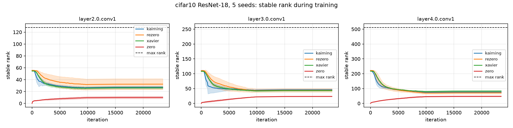
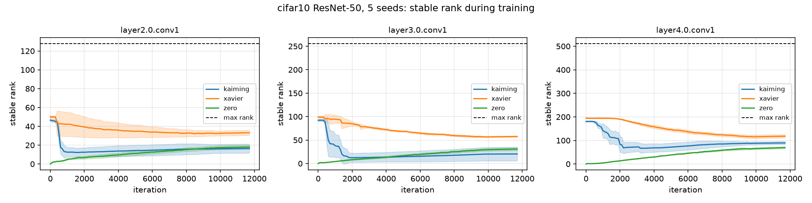
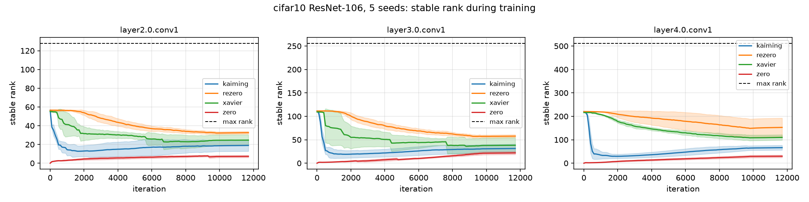
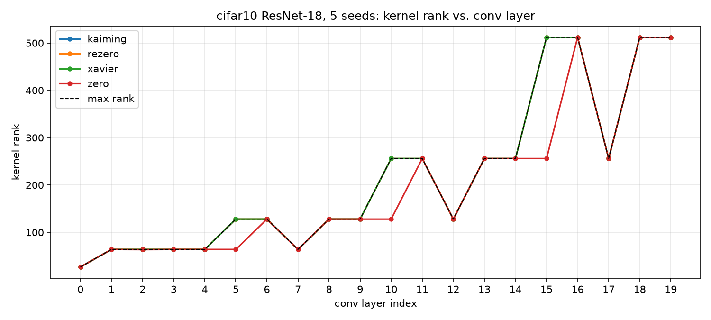
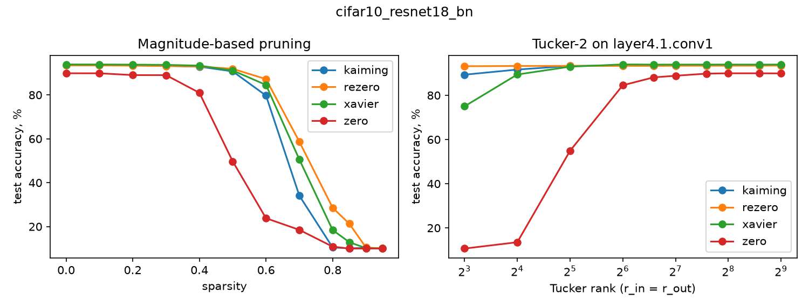

# HW2 — ZerO Initialization (arXiv:2110.12661)

## Структура

```
hw2/src/
  zero_init.py    # Algorithm 1 (матрицы), Algorithm 2 (свёртки), ZerO для слоёв Transformer
  inits.py        # zero | kaiming | xavier | rezero (CNN); + standard (Transformer)
  resnet.py       # ResNet + опциональный ReZero-gate α на residual-ветке
  transformer.py  # LM: стандартный / ZerO / ReZero (RZTX) encoder
  data.py         # CIFAR-10, ImageNet (ImageFolder), WikiText-2
  metrics.py      # top-1 error, perplexity, stable rank, kernel rank, mean ± std
  training.py     # обучение CNN, траектории stable rank, kernel rank
  lm_training.py  # обучение LM, перплексия
  compression.py  # magnitude pruning, Tucker-2
  train.py        # CLI: CNN
  train_lm.py     # CLI: Transformer
  compress.py     # CLI: прунинг + Tucker-2 по чекпоинтам
  report.py       # таблицы (mean ± std) и графики
```

Зависимости в корневом `pyproject.toml` (`uv sync`). Все команды запускаются из корня репозитория.

Замеры выполнены на одной **NVIDIA GeForce RTX 4060 Laptop GPU** (≈7.8 ГиБ доступно PyTorch), драйвер **570.211.01**.

## Эксперименты


### Обучение ResNet на CIFAR-10


Первый эксперимент — обучение ResNet-18 и ResNet-50 на CIFAR-10. Отличие от эксперимента из статьи в том, что ResNet-50 было решено обучить и протестировать на другом датасете, т.к. ImageNet слишком большой. Также было всего 5 запусков, вместо 10, и сокращено количество эпох, чтобы не затягивать обучение моделей надолго.

Помимо этого, было решено сравнить с другим способом инициализации ReZero. ReZero: в каждом residual-блоке x ← x + α F(x) с α = 0 на старте; веса свёрток — случайно инициализированы. Из-за α = 0 свёрточные слои ведут себя как identity.

```bash
.venv/bin/python hw2/src/run_experiments.py --dataset cifar10 --depth 18 -k 5 --amp
.venv/bin/python hw2/src/run_experiments.py --dataset cifar10 --depth 50 -k 5 --epochs 60 --warmup-epochs 5 --milestones 20 35 50 --amp
```

|Модель|Метод|Test error|
| - | - | - |
| ResNet-18  |   ZerO    | `9.73 ± 1.13` (prop.) |
| ResNet-18  |   Kaiming | `6.58 ± 0.21` |
| ResNet-18  |   Xavier  | `6.24 ± 0.01` |
| ResNet-18  |   ReZero  | `6.57 ± 0.14` |
| ResNet-50  |   ZerO    | `7.78 ± 0.30` (prop.) |
| ResNet-50  |   Kaiming | `8.74 ± 0.44` |
| ResNet-50  |   Xavier  | `6.52 ± 0.07` |
| ResNet-106 |   ZerO    | `9.58 ± 1.04` (prop.) |
| ResNet-106 |   Kaiming | `11.03 ± 2.76` |
| ResNet-106 |   Xavier  | `6.91 ± 0.28` |
| ResNet-106 |   ReZero  | `6.22 ± 0.14` |

Видно, что предланаемый метод проиграывает, ошибка у ZerO выше, чем у остальных. На ResNet-50 и ResNet-106 ошибка становится меньше, чему у Kaiming, но всё ещё больше Xavier и ReZero. Для данной задачи метод проигрывает стохастичной инициализации.


### Transformer на wikitext


Также авторы статьи предлагают использовать метод для обучения transformer. Этот эксперимент удалось повторить целиком.

```bash
.venv/bin/python hw2/src/train_lm.py   --inits standard zero   --layers 2 4 6 8 10 20   --seeds 0   --epochs 20   --decay-epoch 10   --warmup-epochs 5   --out-dir hw2/experiments/wikitext2_transformer
```

Таблица посчитанной perplexity

| Количество слоёв | 2 | 4 | 6 | 8 | 10 | 20 |
| ---------------- | - | - | - | - | -- | -- |
| Standard         | 342.32 | 346.55 | 355.46 | 365.53 | 375.98 | 510.20 |
| ZerO             | 352.81 | 374.11 | 398.51 | 423.90 | 452.53 | 928.09 |

Полчились расхождения в со статьёй. У авторов perplexity именьшалась с увеличением количества слоёв трансформера. Кроме того, ZerO побеждал по метрике, но получилось всё иначе. В статье не указаны гиперпараметры обучения, поэтому я использовал гиперпараметры из экспериментов с ResNet. 

Возможно, проблема как раз в этом, либо их метод значительно уступает случайным инициализациям. Причём рост perplexity выглядит реальным, т.к. мы увеличиваем сложность модели без увеличения количества эпох обучения, т.е. модель не успевает выучить нужные зависимости.


### Обучение без BatchNorm


К сожалению, не получилось обучить сверхглубокие сети как в статье из-за малого количества доступной VRAM. Поэтому было решено проверить обучение без BN, т.к. авторы заявляют возможность лучшей сходимости без него как одно из преимуществ метода.

```bash
for d in 26 42 58 74 90 106; do   .venv/bin/python hw2/src/run_experiments.py     --dataset cifar10  --lr 0.001    --batch_size 16     --warmup-epochs 5     --depth "$d"     --norm none     --inits zero kaiming xavier rezero     -k 1     --epochs 15     --amp     --exp-dir "hw2/experiments/cifar10_resnet${d}_nobn_lr0001"; done
```


### Ранги матриц и оптимизация


Команда запуска прунинга и tucker-2 decomposition (декомпозиция свёртки: сначала сжатие каналов до $r_{in}$ с 1x1 размером ядра, потом примение kxk ядра и переход в $r_{out}$ каналов, и потом повышение каналов до $C_{out}$)

```bash
.venv/bin/python hw2/src/compress.py   hw2/experiments/cifar10_resnet18/models/last_*_seed0.pt   --tucker-layer layer4.1.conv1
```

Stable rank матриц ведёт себя так же, как и в статье — сначала низкий, потом возрастает. Однако значение ранга кернелов в статье значительно ниже, чем у случайной инициализации, у нас же эти значения почти совпадают.



  <figcaption>Рис. 1. Stable rank для ResNet-18</figcaption>
</figure>


  <figcaption>Рис. 2. Stable rank для ResNet-50</figcaption>
</figure>


  <figcaption>Рис. 3. Stable rank для ResNet-106</figcaption>
</figure>


  <figcaption>Рис. 4. Ранг свёрток для каждого слоя</figcaption>
</figure>



  <figcaption>Рис. 5. Слева график accuracy в зависимости от процента прунинга. Справа график зависимости accuracy от ранга tucker-2 decomposition</figcaption>
</figure>


</br>
Прунинг и tucker-2 decomposition над ResNet-18 показывает сильное падение качества для ZerO инициализации. Хотя при малом ранге такого быть не должно.


### Выводы


Результаты получились значительно хуже, чем в статье. Однако stable rank получился таким, как заявляют авторы. Не думаю, что результаты хуже из-за релизации инициализации, потому что технически там нет ничего сложного: инициализация единичной матрицей, подсчёт матрицы Адамара.

Возможно, проблема в гиперпараметрах обучения (lr, scheduling) для тех экспериментов, для которых они не были указаны.

Если же предположить, что реализация пайплайна и ZerO, а также гиперпараметры корретны, то предлагаемый метод не даёт существенного преимущества над случайными инициализациями. Эксперименты не демонстрируют ни качества на глубоких сетях без BN, ни для просто ResNet или Transformer.

Также авторы заявляют, что обучение модели становиться более интерпретируемым и воспроизовдимым, однако они сравниваются только на специфичных конфигурациях: сети без BN, высокий lr.

В результате, предлагаемое решение тяжело назвать применимым, потому что методы случаной инициализации показывают результаты лучше, а проблема воспроизводимости решается фиксацией сида.
